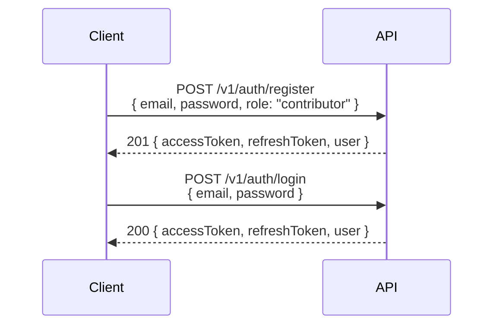
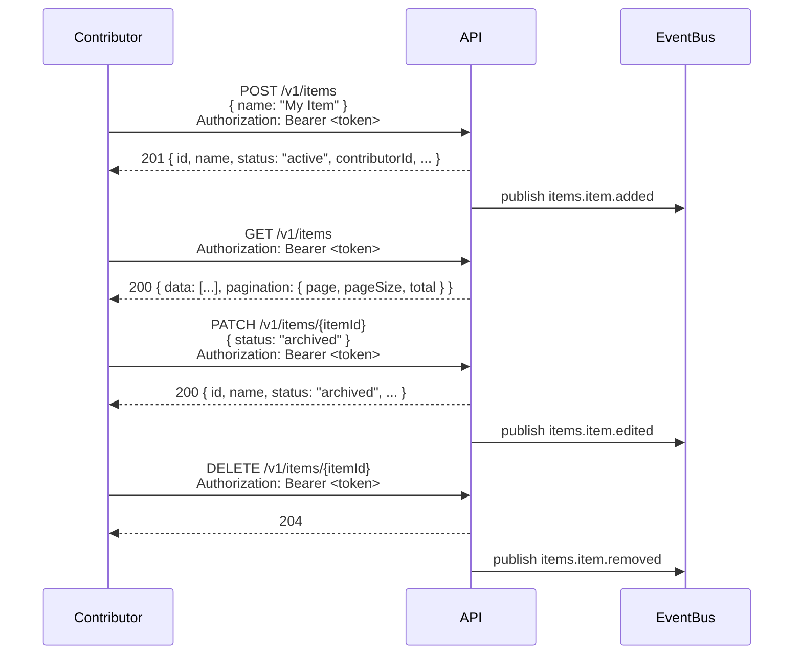
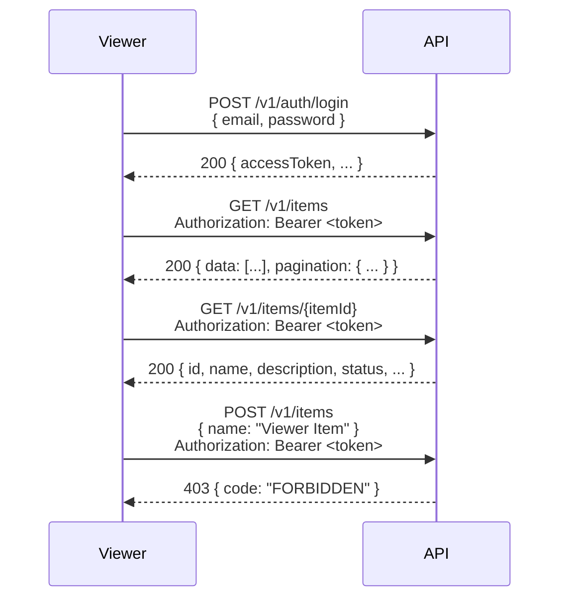
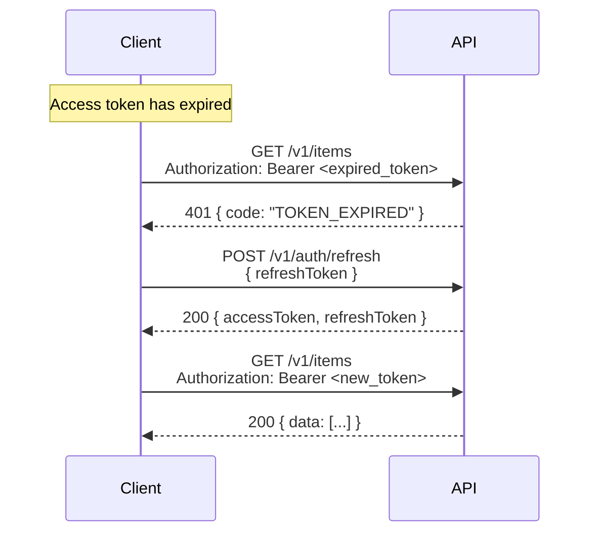
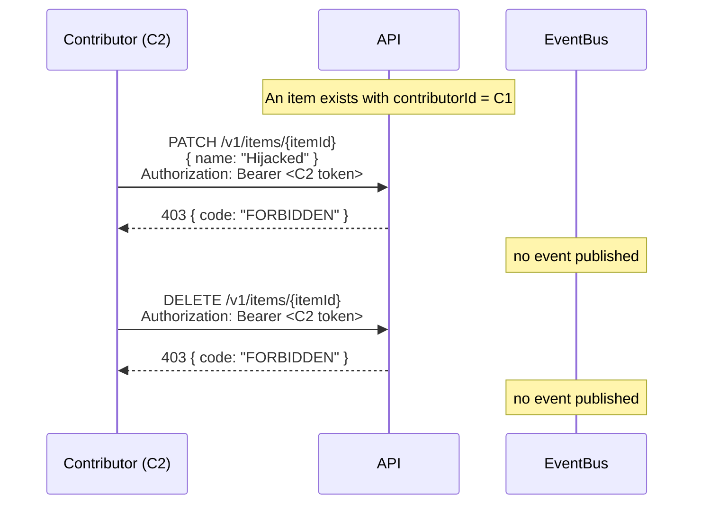

# Sequence Diagrams — Items

Interaction flows for the Items domain. Diagrams reference operation
paths from `contracts/openapi.yaml` and event channels from
`contracts/asyncapi.yaml` by name.

---

## Flow 1: Register and Log In

---

## Flow 2: Contributor Creates and Manages Items

---

## Flow 3: Viewer Browses Items

---

## Flow 4: Token Refresh

---

## Flow 5: Non-Owner Edit Rejected

A contributor attempts to edit or remove an item that belongs to a
different contributor. The ownership check (see `auth-matrix.md`)
rejects the request and no `ItemEdited` event is published.

---

## Notes

- All authenticated requests include `Authorization: Bearer <token>`
  (omitted from some labels for brevity).
- Every `4xx` error path is enumerated in `auth-matrix.md` and
  `error-catalogue.md`. The flows above show the happy paths plus the
  two most diagnostically interesting failure paths (Viewer-attempts-write
  in Flow 3, Non-owner-edit/remove in Flow 5).
- Event publication is shown as a fire-and-forget message to an
  abstract `EventBus`; the concrete transport binding lives in
  `contracts/asyncapi.yaml` and is not part of this flow.
